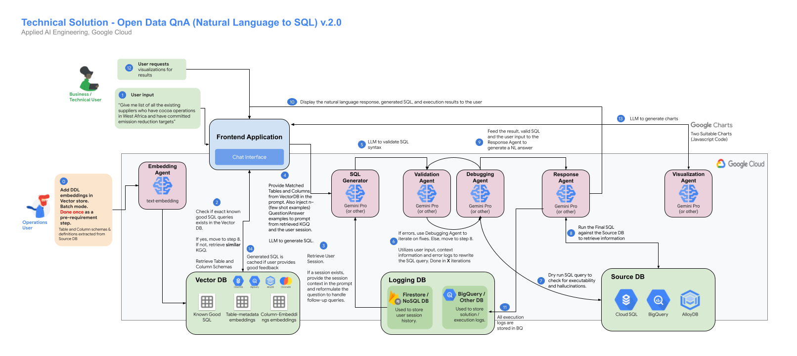

<p align="center">
    <a href="utilities/imgs/aaie.png">
        
    </a>
</p>
<p align="center">
    <a href="https://sites.google.com/corp/google.com/genai-solutions/home?authuser=0">
        
    </a>
</p>
<h1 align="center">Open Data QnA - Chat with your SQL Database</h1> 

_______________

<div align="center"">
  <strong>🚨 Version 2.0.0 is now live! Refer to the <a href="docs/changelog.md">Release Notes</a> for detailed information on updates and fixes. 🚨</strong>
</div>

_______________

✨ Overview
-------------
The **Open Data QnA** python library enables you to chat with your databases by leveraging LLM Agents on Google Cloud.

Open Data QnA enables a conversational approach to interacting with your data. Ask questions about your PostgreSQL or BigQuery databases in natural language and receive informative responses, without needing to write SQL. Open Data QnA leverages Large Language Models (LLMs) to bridge the gap between human language and database queries, streamlining data analysis and decision-making.


**Key Features:**

* **Conversational Querying with Multiturn Support:** Ask questions naturally, without requiring SQL knowledge and ask follow up questions.
* **Table Grouping:** Group tables under one usecase/user grouping name which can help filtering your large number tables for LLMs to understand about.
* **Multi Schema/Dataset Support:** You can group tables from different schemas/datasets for embedding and asking questions against.
* **Prompt Customization and Additional Context:** The prompts that are being used are loaded from a yaml file and it also give you ability to add extra context as well
* **SQL Generation:** Automatically generates SQL queries based on your questions.
* **Query Refinement:** Validates and debugs queries to ensure accuracy.
* **Natural Language Responses:** DRun queries and present results in clear, easy-to-understand language.
* **Visualizations (Optional):** Explore data visually with generated charts.
* **Extensible:** Customize and integrate with your existing workflows(API, UI, Notebooks).


It is built on a modular design and currently supports the following components: 

### Database Connectors
* **Google Cloud SQL for PostgreSQL**
* **Google BigQuery**
* **Google Firestore(for storing session logs)**

### Vector Stores 
* **PGVector on Google Cloud SQL for PostgreSQL**
* **BigQuery Vector Store**

### Agents 
* **BuildSQLAgent:** An agent specialized in generating SQL queries for BigQuery or PostgreSQL databases. It analyzes user questions, available table schemas, and column descriptions to construct syntactically and semantically correct SQL queries, adapting its process based on the target database type.
* **ValidateSQLAgent:** An agent that validates the syntax and semantic correctness of SQL queries. It uses a language model to analyze queries against a database schema and returns a JSON response indicating validity and potential errors.
* **DebugSQLAgent:** An agent designed to debug and refine SQL queries for BigQuery or PostgreSQL databases. It interacts with a chat-based language model to iteratively troubleshoot queries, using error messages to generate alternative, correct queries.
* **DescriptionAgent:** An agent specialized in generating descriptions for database tables and columns. It leverages a large language model to create concise and informative descriptions that aid in understanding data structures and facilitate SQL query generation.
* **EmbedderAgent:** An agent specialized in generating text embeddings using Large Language Models (LLMs). It supports direct interaction with Vertex AI's TextEmbeddingModel or uses LangChain's VertexAIEmbeddings for a simplified interface.
* **ResponseAgent:** An agent that generates natural language responses to user questions based on SQL query results. It acts as a data assistant, interpreting SQL results and transforming them into user-friendly answers using a language model.
* **VisualizeAgent:** An agent that generates JavaScript code for Google Charts based on user questions and SQL results. It suggests suitable chart types and constructs the JavaScript code to create visualizations of the data.

**Note:** the library was formerly named Talk2Data. You may still find artifacts with the old naming in this repository. 

📏 Architecture
-------------
<p align="center">
    <a href="utilities/imgs/OpenDataQnA_architecture.png">
        
    </a>
</p>

A detailed description of the Architecture can be found [`here`](/docs/architecture.md) in the docs. 


🧬 Repository Structure 
-------------
Details on the Repository Structure can be found [`here`](/docs/repo_structure.md) in the docs. 


<!-- 🏁 Getting Started: Quick Start   
-------------
**NOTE: THIS IS STILL v1 - UPDATING THE STANDALONE NOTEBOOK TO v2 IS WIP**

**Quickstart with Open Data QnA: [Standalone BigQuery Notebook](/notebooks/(standalone)Run_OpenDataQnA.ipynb)**

Copy both [Standalone BigQuery Notebook](/notebooks/(standalone)Run_OpenDataQnA.ipynb) and [pyproject.toml](/pyproject.toml)

This notebook offers a streamlined way to experience the core functionality of Open Data QnA using BigQuery as both the data source and vector store. While it doesn't encompass the full flexibility of the repository setup, it's a perfect starting point to quickly test and explore the conversational querying capabilities of Open Data QnA with your own BigQuery datasets.  -->


🏁 Getting Started: Main Repository 
-------------

### Clone the repository and switch to the correct directory 
   
    git clone git@github.com:GoogleCloudPlatform/Open_Data_QnA.git
    cd Open_Data_QnA

### 🚧 **Prerequisites**

Make sure that Google Cloud CLI and Python are installed before moving ahead! You can refer to the link below for guidance

Installation Guide: https://cloud.google.com/sdk/docs/install

Download Python: https://www.python.org/downloads/

ℹ️ **You can setup this solution with three approaches. Choose one based on your requirements:**
  - **A)** Using [Jupyter Notebooks](#a-jupyter-notebook-based-approach) (For better view at what is happening at each stage of the solution)
  - **B)** Using [CLI](#b-command-line-interface-cli-based-approach) (For ease of use and running with simple python commands, without the need to understand every step of the solution)
  - **C)** Using [terraform deployment](#c-using-terraform-to-deploy-the-solution) including your backend APIs with UI


### A) Jupyter Notebook Based Approach

#### 💻 **Install Code Dependencies (Create and setup venv)**

#### **All commands in this cell to be run on the terminal (typically Ctrl+Shift+`) where your notebooks are running**
Install the dependencies by running the poetry commands below 

```
# Install poetry
pip uninstall poetry -y
pip install poetry --quiet

#Run the poetry commands below to set up the environment
poetry lock #resolve dependecies (also auto create poetry venv if not exists)
poetry install --quiet #installs dependencies
poetry env info #Displays the evn just created and the path to it

poetry shell #this command should activate your venv and you should see it enters into the venv

##inside the activated venv shell []

#If you are running on Worbench instance where the service account used has required permissions to run this solution you can skip the below gcloud auth commands and get to next kernel creation section

gcloud auth login  # Use this or below command to authenticate

gcloud auth application-default login

gcloud services enable \
    serviceusage.googleapis.com \
    cloudresourcemanager.googleapis.com --project <<Enter Project Id>>

```

Chose the relevant instructions based on where you are running the notebook

**For IDEs like Cloud Shell Editor, VS Code**

For IDEs adding Juypter Extensions will automatically give you option to change the kernel. If not, manually select the python interpreter in your IDE (The exact is shown in the above cell. Path would look like e.g. /home/admin_/opendata/.venv/bin/python or ~cache/user/opendataqna/.venv/bin/python)

Proceed to the Step 1 below


**For Jupyter Lab or Jupyter Environments on Workbench etc**

Create Kernel for with the envrionment created

```
pip install jupyter

ipython kernel install --name "openqna-venv" --user 

```

Restart your kernel or close the exsiting notebook and open again, you should now see the "openqna-venv" in the kernel drop down

**What did we do here?**

* Created Application Default Credentials to use for the code
* Added venv to kernel to select for running the notebooks (For standalone Jupyter setups like Workbench etc)

#### 1. Run the [1_Setup_OpenDataQnA](/notebooks/1_Setup_OpenDataQnA.ipynb) (Run Once for Initial Setup) 

This notebook guides you through the setup and execution of the Open Data QnA application. It provides comprehensive instructions for setup the solution.


#### 2. Run the [2_Run_OpenDataQnA](/notebooks/2_Run_OpenDataQnA.ipynb)

This notebook guides you by reading the configuration you setup with [1_Setup_OpenDataQnA](/1_Setup_OpenDataQnA) and running the pipeline to answer questions about your data.

#### 3. [Loading Known Good SQL Examples](/notebooks/3_LoadKnownGoodSQL.ipynb)
   
   In case you want to separately load Known Good SQLs please run this notebook once the config variables are setup in config.ini file. This can be run multiple times just to load the known good sql queries and create embeddings for it.

___________

### B) Command Line Interface (CLI) Based Approach

#### 1. Add Configuration values for the solution in [config.ini](/config.ini)

For setup we require details for vector store, source database etc. Edit the [config.ini](/config.ini) file and add values for the parameters based of below information.

ℹ️ Follow the guidelines from the [config guide document](/docs/config_guide.md) to populate your [config.ini](/config.ini) file.

**Sources to connect**

- This solution lets you setup multiple data source at same time.
- You can group multiple tables from different datasets or schema into a grouping and provide the details
- If your dataset/schema has many tables and you want to run the solution against few you should specifically choose a group for that tables only

**Format for data_source_list.csv**

**source | user_grouping | schema | table**

**source** - Supported Data Sources. #Options: bigquery , cloudsql-pg

**user_grouping** - Logical grouping or use case name for tables from same or different schema/dataset. When left black it default to the schema value in the next column

**schema** - schema name for postgres or dataset name in bigquery 

**table** - name of the tables to run the solutions against. Leave this column blank after filling schema/dataset if you want to run solution for whole dataset/schema

Update the [data_source_list.csv](/scripts/data_source_list.csv) according for your requirement.

Note that the source details filled in the csv should have already be present. If not please use the Copy Notebooks if you want the demo source setup.

Enabled Data Sources:
* PostgreSQL on Google Cloud SQL (Copy Sample Data: [0_CopyDataToCloudSqlPG.ipynb](0_CopyDataToCloudSqlPG.ipynb))
* BigQuery (Copy Sample Data: [0_CopyDataToBigQuery.ipynb](0_CopyDataToBigQuery.ipynb))

#### 2. Creating Virtual Environment and Install Dependencies

```
pip install poetry --quiet
poetry lock
poetry install --quiet
poetry env info
poetry shell
```
Authenticate your credentials

```
gcloud auth login

or 

gcloud auth application-default login
```
```
gcloud services enable \
    serviceusage.googleapis.com \
    cloudresourcemanager.googleapis.com --project <<Enter Project Id>>
```
```
gcloud auth application-default set-quota-project <<Enter Project Id for using resources>>
```

Enable APIs for the solution setup

```
gcloud services enable \
  cloudapis.googleapis.com \
  compute.googleapis.com \
  iam.googleapis.com \
  run.googleapis.com \
  sqladmin.googleapis.com \
  aiplatform.googleapis.com \
  bigquery.googleapis.com \
  firestore.googleapis.com --project <<Enter Project Id>>

```

#### 3. Run [env_setup.py](/env_setup.py) to create vector store based on the configuration you did in Step 1

```
python env_setup.py
```

#### 4. Run [opendataqna.py](/opendataqna.py) to run the pipeline you just setup

The Open Data QnA SQL Generation tool can be conveniently used from your terminal or command prompt using a simple CLI interface. Here's how:

```
python opendataqna.py --session_id "122133131f--ade-eweq" --user_question "What is most 5 common genres we have?" --user_grouping "MovieExplorer-bigquery"
```

Where

*session_id* : Keep this unique unique same for follow up questions.

*user_question* : Enter your question in string

*user_grouping* : Enter the BQ_DATASET_NAME for BigQuery sources or PG_SCHEMA for PostgreSQL sources (refer your [data_source_list.csv](/scripts/data_source_list.csv) file)


**Optional Parameters**

You can customize the pipeline's behavior using optional parameters. Here are some common examples:
```
# Enable the SQL debugger:
python opendataqna.py --session_id="..." --user_question "..." --user_grouping "..." --run_debugger

# Execute the final generated SQL:
python opendataqna.py --session_id="..." --user_question "..." --user_grouping "..." --execute_final_sql

# Change the number of debugging rounds:
python opendataqna.py --session_id="..." --user_question "..." --user_grouping "..." --debugging_rounds 5

# Adjust similarity thresholds:
python opendataqna.py --session_id="..." --user_question "..." --user_grouping "..." --table_similarity_threshold 0.25 --column_similarity_threshold 0.4

```

You can find a full list of available options and their descriptions by running:

```
python opendataqna.py --help
```

### C) Using Terraform to deploy the solution

The provided terraform streamlines the setup of this solution and serves as a blueprint for deployment. The script provides a one-click, one-time deployment option. However, it doesn't include CI/CD capabilities and is intended solely for initial setup.

> [!NOTE]
> Current version of the Terraform Google Cloud provider does not support deployment of a few resources, this solution uses null_resource to create those resources using Google Cloud SDK.

Prior to executing terraform, ensure that the below mentioned steps have been completed.

#### Data Sources Set Up

1. Source data should already be available. If you do not have readily available source data, use the notebooks [0_CopyDataToBigQuery.ipynb](/notebooks/0_CopyDataToBigQuery.ipynb) or [0_CopyDataToCloudSqlPG.ipynb](/notebooks/0_CopyDataToCloudSqlPG.ipynb) based on the preferred source to populate sample data.
2. Ensure that the [data_source_list.csv](/scripts/data_source_list.csv) is populated with the list of datasources to be used in this solution. Terraform will take care of creating the embeddings in the destination. Use [data_source_list_sample.csv](/scripts/data_source_list_sample.csv) to fill the [data_source_list.csv](/scripts/data_source_list.csv)
3. If you want to use known good sqls for few shot prompting, ensure that the [known_good_sql.csv](/scripts/known_good_sql.csv) is populated with the required data. Terraform will take care of creating the embeddings in the destination.

#### Enable Firebase
Firebase will be used to host the frontend of the application.

1. Go to https://console.firebase.google.com/
1. Select add project and load your Google Cloud Platform project
1. Add Firebase to one of your existing Google Cloud projects
1. Confirm Firebase billing plan
1. Continue and complete


#### Terraform deployment
> [!NOTE]  
> Terraform apply command for this application uses gcloud config to fetch & pass the set project id to the scripts. Please ensure that gcloud config has been set to your intended project id before proceeding.

> [!IMPORTANT]  
> The Terraform scripts require specific IAM permissions to function correctly. The user needs either the broad `roles/resourcemanager.projectIamAdmin` role or a custom role with tailored permissions to manage IAM policies and roles.
> Additionally, one script TEMPORARILY disables Domain Restricted Sharing Org Policies to enable the creation of a public endpoint. This requires the user to also have the `roles/orgpolicy.policyAdmin` role.

1. Install [terraform 1.7 or higher](https://developer.hashicorp.com/terraform/install).
1. [OPTIONAL] Update default values of variables in [variables.tf](/terraform/variables.tf) according to your preferences. You can find the description for each variable inside the file. This file will be used by terraform to get information about the resources it needs to deploy. If you do not update these, terraform will use the already specified default values in the file.
1. Move to the terraform directory in the terminal

```
cd Open_Data_QnA/terraform

#If you are running this outside Cloud Shell you need to set up your Google Cloud SDK Credentials

gcloud config set project <your_project_id>
gcloud auth application-default set-quota-project <your_project_id>

gcloud services enable \
    serviceusage.googleapis.com \
    cloudresourcemanager.googleapis.com --project <<Enter Project Id>>

sh ./scripts/deploy-all.sh

```
This script will perform the following steps:
1. **Run terraform scripts** - These terraform scripts will generate all the GCP resources and configuration files required for the frontend & backend. It will also generate embeddings and store it in the destination vector db.
1. **Deploy cloud run backend service with latest backend code** - The terraform in the previous step uses a dummy container image to deploy the initial version of cloud run service. This is the step where the actual backend code gets deployed.
1. **Deploy frontend app** - All the config files, web app etc required to create the frontend are deployed via terraform. However, the actual UI deployment takes place in this step.

### After deployment
***Auth Provider***

You need to enable at least one authentication provider in Firebase, you can enable it using the following steps:
1. Go to https://console.firebase.google.com/project/your_project_id/authentication/providers (change the `your_project_id` value)
2. Click on Get Started (if needed)
3. Select Google and enable it
4. Set the name for the project and support email for project
5. Save

This should deploy you end to end solution in the project with firebase web url

For detailed steps and known issues refer to  README.md under [`/terraform`](/terraform/)


🖥️ Build a angular based frontend for this solution   
---------------------------------------------------
Deploy backend apis for the solution, refer to the README.md under [`/backend-apis`](/backend-apis/). This APIs are designed with work with the frontend and provide access to run the solution.

Once the backend APIs deployed successfully deploy the frontend for the solution, refer to the README.md under [`/frontend`](/frontend/).


📗 FAQs and Best Practices  
-------------
If you successfully set up the solution accelerator and want to start optimizing to your needs, you can follow the tips in the [`Best Practice doc`](/docs/best_practices.md).
Additionally, if you stumble across any problems, take a look into the [`FAQ`](/docs/faq.md).

If neither of these resources helps, feel free to reach out to us directly by raising an Issue. 

🧹 CleanUp Resources 
-------------
To clean up the resources provisioned in this solution, use commands below to remove them using gcloud/bq: 

For cloudsql-pgvector as vector store : [Delete SQL Instance](<https://cloud.google.com/sql/docs/mysql/delete-instance#delete-cloud-sql-instance>)

```
gcloud sql instances delete <CloudSQL Instance Name> -q
```

Delete BigQuery Dataset Created for Logs and Vector Store : [Remove BQ Dataset](<https://cloud.google.com/bigquery/docs/reference/bq-cli-reference#bq_rm>)

```
bq rm -r -f -d <BigQuery Dataset Name for OpenDataQnA>
```

(For Backend APIs)Remove the Cloud Run service : [Delete Service](<https://cloud.google.com/run/docs/managing/services#delete>)

```
gcloud run services delete <Cloud Run Service Name>
```

For frontend, based on firebase: [Remove the firebase app](<https://support.google.com/firebase/answer/7047853?sjid=6757651181596811904-AP#how-to-remove>)

📄 Documentation
-------------

* [Open Data QnA Source Code (GitHub)](<https://github.com/GoogleCloudPlatform/Open_Data_QnA>)
* [Open Data QnA usage notebooks](/notebooks)
* [`Architecture`](/docs/architecture.md)
* [`FAQ`](/docs/faq.md)
* [`Best Practice doc`](/docs/best_practices.md)


🚧 Quotas and limits
------------------

[BigQuery quotas](<https://cloud.google.com/bigquery/quotas>) including hardware, software, and network components.

[Gemini quotas](<https://cloud.google.com/gemini/docs/quotas>).


🪪 License
-------

Open Data QnA is distributed with the [Apache-2.0 license](<LICENSE>).

It also contains code derived from the following third-party packages:

* [pandas](<https://pandas.pydata.org/>)
* [Python](<https://www.python.org/>)
  

🧪 Disclaimer
----------

This repository provides an open-source solution accelerator designed to streamline your development process. Please be aware that all resources associated with this accelerator will be deployed within your own Google Cloud Platform (GCP) instances.

It is imperative that you thoroughly test all components and configurations in a non-production environment before integrating any part of this accelerator with your production data or systems.

While we strive to provide a secure and reliable solution, we cannot be held responsible for any data loss, service disruptions, or other issues that may arise from the use of this accelerator.

By utilizing this repository, you acknowledge that you are solely responsible for the deployment, management, and security of the resources deployed within your GCP environment.

If you encounter any issues or have concerns about potential risks, please refrain from using this accelerator in a production setting.

We encourage responsible and informed use of this open-source solution.


🙋 Getting Help
----------

If you have any questions or if you found any problems with this repository, please report through GitHub issues.
