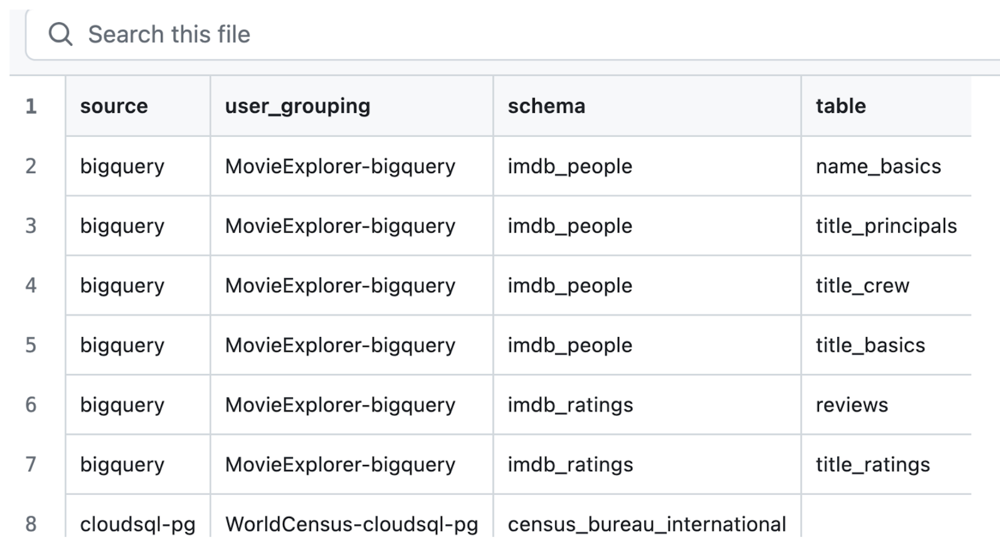
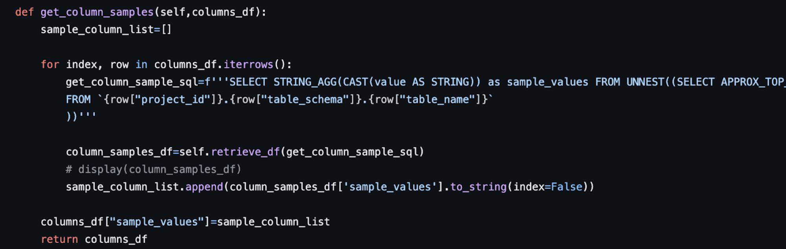
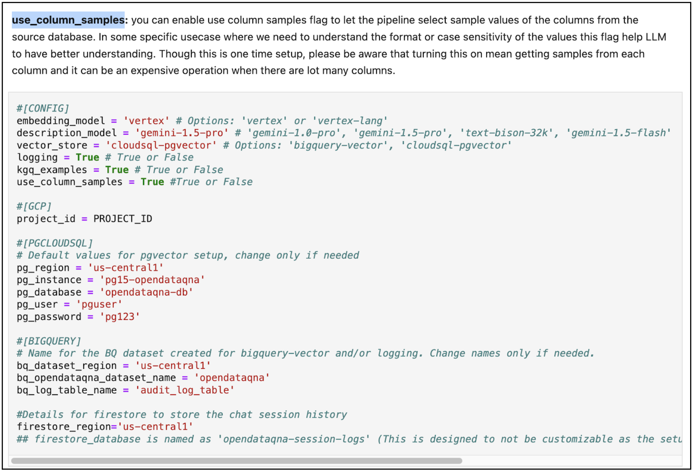
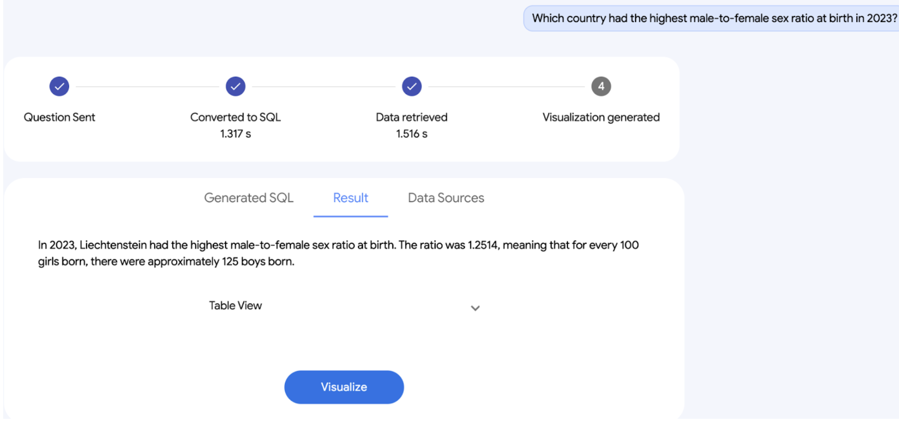

# Release Notes - Open Data QnA v2.0.0
This major release brings significant improvements and new features to Open Data QnA.

## Multi turn capabilities
Ability to interact back and forth with the database in a context. Initial v1 was established with a single turn query. In this release, we have created a multi turn architecture that saves the session info, previous query information and can answer accordingly. For more information on the architecture:  link 

## Table Grouping

Initial v1 was tied to single dataset processing and all the tables under this dataset. In reality, users most likely want to restrict the tables and add other datasets if needed. This table grouping provides a way for users to be able to define their scope 

    

## Data Sampling
We provide a sampling of data values in a column to provide contextual information to the SQL Generation agent. For this, top 5 values are retrieved for every column in the specified tables. 
This information is aggregated and stored back into the vector store, and is retrieved during the retrieval process. 

    

    

## Data summarization
In the initial V1 release, the results were in tabular format. With this release , we provide summarized answers in a natural language format that can be integrated into a chatbot. User does have an option to still get the tabular and visualized results based on their settings.

    

## Resolving ambiguities
The multi-turn approach helps to resolve ambiguities in the questions, by allowing the user to provide follow-up questions and clarifications. 

Furthermore, it is possible to provide additional context in the instruction prompt to let the LLM resolve ambiguities before triggering the pipeline. This can be achieved with the help of a LLM router added as a first layer before the Open Data QnA pipeline. 
These clarification questions can help provide more context to the SQL creation.

Ambiguities can be categorized into semantic, application, business and database context. With this release we look for semantic and business level context and resolve such ambiguities through the chat interface. 

## UX through Flutter and Streamlit

In addition to the AngularJS, we have added support through Flutter as part of the release which can be found under the front end code folder. 
Furthermore, to enable more efficient development, we have added support for streamlit, so users can quickly iterate and test in a dev frontend before deploying to Angular or Flutter. 

# Release Notes - Open Data QnA v1.2.0
This release brings significant improvements and new features to enhance the stability, functionality, and user experience of the Open Data QnA.

## 🗝️ Key Enhancements:
* **Enhanced Functionality:** Added the ability to specify a list of table names to be processed in BQ, instead of parsing all tables in a dataset. 
* **Improved Debugging:** The SQL debugger now incorporates the user's question into its prompts, leading to more accurate and relevant debugging suggestions.
* **Simplified Setup:** Streamlined notebook setup and environment variable management for a smoother user experience.
* **Quickstart**: Added a standalone notebook for quick experimentation with the overall approach, limited to BQ. 
* **Flexible Configuration:** Introduced optional arguments for the CLI pipeline, allowing users to customize various parameters like table and column similarity thresholds.
* **Code Refinements:** Removed hardcoded embedding models and added a save_config function for cleaner configuration management.
* **Bug Fixes:** Resolved various bugs, including issues with root directory checking, utility initialization, source type determination, and safety settings.
* **Expanded Documentation:** Added comprehensive docstrings to functions for better clarity and understanding.

## 📈 Additional Improvements:
* **Code Cleanup:** Removed unnecessary files and redundant code, improving overall code maintainability.
* **Updated README:** Improved the README file with clearer instructions and updated information.
* **Enhanced User Interface:** Introduced a CLI approach (experimental) for more streamlined interaction.

## 🐜 Bug Fixes:
* Fixed bugs in standalone notebook functionality.
* Removed telemetry test code.
* Corrected embedding distances in BigQuery.
* Resolved various typos and inconsistencies in the codebase.

This release marks a significant step forward in the development of the Open Data QnA SQL Generation tool, making it more reliable, flexible, and user-friendly. We encourage you to upgrade and explore the new features!
