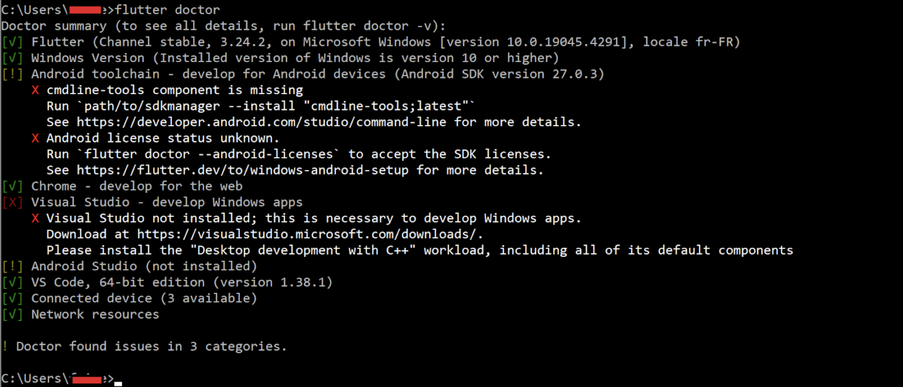
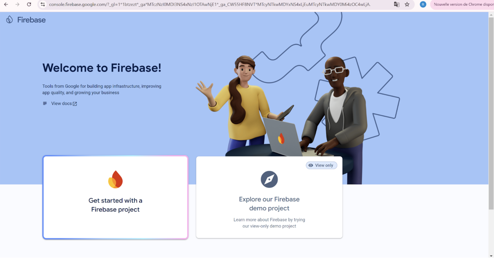
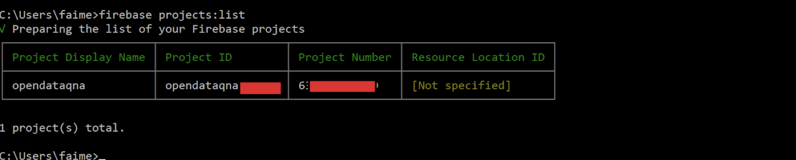
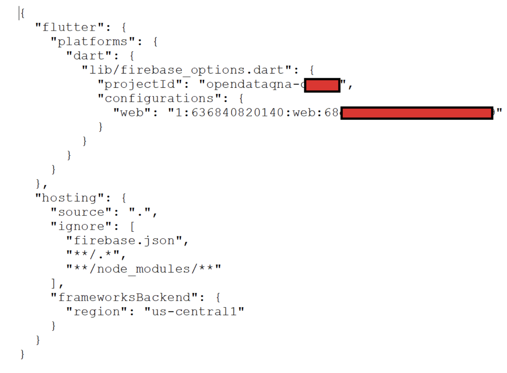
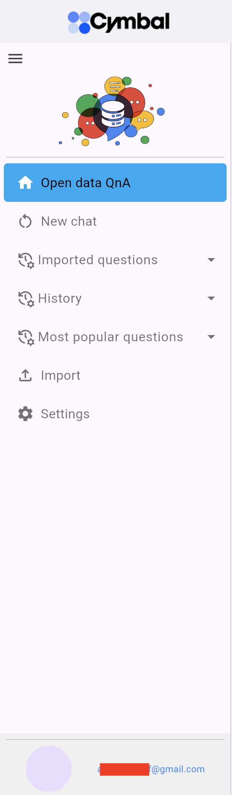

# Deploy the Flutter-based Frontend demo UI

<p align="center">
    <a>
        
    </a>
</p>

## Technologies and Components
In order to use easily the Open Data QnA SDK and the backend you have just installed (please refer to README.md related to the backend on this repo for the details if not installed yet) you need to have a front end. 
This page explains how to install the frontend provided by this solution gracefully so that you can jump start the use of the Open Data QnA solution.    
Obviously, you can pretty much develop your own frontend and call the APIs available of the backend deployments.

There are 2 versions of the frontend, one written in Angular and one written in Flutter, an Open Souce UI framework written in dart language and backed up by Google. Functionality-wise, they are both equivalent even though some minor differences may exist.  

This readme is about installing the Flutter-based frontend.
For more  information on Flutter :
- [Flutter documentation](https://docs.flutter.dev/?_gl=1*17csnxq*_ga*MTI3NTU2MjQxMC4xNzI1ODc2Njg5*_ga_04YGWK0175*MTcyNTg3NjY4OS4xLjAuMTcyNTg3NjY4OS4wLjAuMA..)

The frontend needs to be deployed to Firebase, a Mobile Backend as a Service. It has a free tier call "Spark Plan" allowing you to use the services required to run the frontend.
For more details on Firebase, plase have a look at the documentation below:
- [Firebase pricing tiers](https://firebase.google.com/pricing)
- [Firebase Documentation](https://firebase.google.com/docs)

## Getting Started

### Installing Flutter and dart SDK

#### Installing Flutter

The first step is to install the Flutter framework.

To build the Flutter app, you can either use an IDE, like Visual Studio Code with the Flutter SDK (and plugin) and relevant extension, or just the Flutter's command-line tools to build the app manually.
This guide only explains how to use the Flutter's command-line tools via the installation of the Flutter SDK bundle (that also contains the dart SDK).

Please click on the link below.
- [Flutter SDK installation](https://docs.flutter.dev/get-started/install)

You'll end-up on the the landing page below. 

1- Click on the platform corresponding to the OS of the desktop you'll install the frontend on.
As an example, let's use Windows :

<p align="center">
    <a>
        
    </a>
</p>

2- Click on the Web type of app :
<p align="center">
    <a>
        
    </a>
</p>

3- Click on the flutter_windows_3.24.2-stable.zip button (version will vary over time)

4- Move the zip file into the target folder you want, let's say "dev"

5- Extract the archive
<p align="center">
    <a>
        
    </a>
</p>

6- Update the PATH environment variable :
%USERPROFILE%\dev\flutter\bin

7- Test the installation by typing the "flutter doctor" command :
<p align="center">
    <a>
        
    </a>
</p>


### Installing Firebase tools

1- Install the Firebase CLI  
In order to interact easily with Firebase, you have to install the Firebase CLI.
You need to install npm first as a prerequisite:

```
npm install -g firebase-tools
```
With these Firebase CLI commands, you're able to authenticate to Firebase and do the deployment of the frontend on the Firebase Hosting service.

2- Test the Firebase CLI

In order to very the Firebase CLI are working fine, login to Firebase using the command below.

```
firebase login
```

For more details on the installation, please look at the link below:
- [Firebase CLI installation documentation](https://firebase.google.com/docs/cli#windows-npm)

### Installing Flutterfire CLI

Flutter is tightly integrated to Firebase.
The flutterfire_cli command,which is part of the FlutterFire CLI, is specifically designed for Flutter projects. It streamlines the process of connecting your Flutter app to Firebase and generating the necessary configuration files (firebase_options.dart) for different platforms (Android, iOS, web, etc.).

Install it from any directory, we'll need it later on.

```
dart pub global activate flutterfire_cli
```

You may need to modify the PATH environment variable to access the flutterfire CLI.
On Windows, the binary is stored in :
%USERPROFILE%\AppData\Local\Pub\Cache\bin

### Creating and configuring the Firebase project

1- Go to the Firebase console

Click on "Get started with a Firebase project"
```
https://console.firebase.google.com/
```

<p align="center">
    <a>
        
    </a>
</p>

2- Give a name to the project

Use the same name you used during the backend installation. As an example, let's us "opendataqna"
<p align="center">
    <a>
        
    </a>
</p>

3- Google Analytics

You can choose to activate Google Analytics or not. This is not required for the app to work.
For the sake of completness, let's use it as it is proposed by default.

<p align="center">
    <a>
        
    </a>
</p>

Just click on the "Continue" button.

<p align="center">
    <a>
        
    </a>
</p>
Then click on the "Create project" button.

Once done, you have access to your newly Firebase project
<p align="center">
    <a>
        
    </a>
</p>

Alternatively, you can also use the "flutterfire configure" CLI to create the Firebase project. 

4- List the project using the Firebase CLI 

Now go back to your terminal and list this new Firebase project :
```
firebase projects:list
```
<p align="center">
    <a>
        
    </a>
</p>

### Creating the Firestore Database

The frontend requires a Firestore database (which is a Firebase service) to work.
The free tier only allows the creation of 1 database that has the default name (derived from the project name)

1-On the Firebase console, click on the Firestore menu

<p align="center">
    <a>
        
    </a>
</p>

2- Select the location
<p align="center">
    <a>
        
    </a>
</p>

3- Select the production mode
<p align="center">
    <a>
        
    </a>
</p>

4- Modify the security rules

The front end needs to read and write on different collections in order to store the configuration, the know good SQL and the imported questions.
For that, you need to change the security rules like below (please take appropriate measures to protect access to the database):

<p align="center">
    <a>
        
    </a>
</p>

### Enabling Sign-In method

The app requires that you authenticate using your Google account, whether it is personal or professional.

1- Go to the Firebase Authentication menu 
For that, go to the Firebase console and click on the Authentication menu and then on the Sing-in method tab:


<p align="center">
    <a>
        
    </a>
</p>


2- Choose Google as the Provider
Click on the Google icon to enable federated identity via Google:

<p align="center">
    <a>
        
    </a>
</p>

3- Update the project level settings with the info below
<p align="center">
    <a>
        
    </a>
</p>


### Installing the frontend

Now that the Firebase project is created, let's get the source code of the Flutter frontend.

1- Create a folder for your project

Creat folder that will contain the source code and the Firebase configuration.
Let's call it opendatadna as well:

```
mkdir OpenDataQnA
```

2- clone the source code from the repository

Go to the opendataqna folder and clone the source code of the frontend app using the command below:
```
git clone https://github.com/GoogleCloudPlatform/Open_Data_QnA.git

cd frontend/frontend-flutter
```

3- Registering the frontend app to Firebase

In order to register the app to Firebase and selected the Firebase project it will leave in, use the flutterfire configure command:
```
flutterfire configure
```
You'll be guided by the command via a couple of questions :
<p align="center">
    <a>
        
    </a>
</p>

You can check on the Firebase console that app has been registered to the opendataqna project by clicking on "Project Overview":
<p align="center">
    <a>
        
    </a>
</p>

4- Deploy the app to Firebase Hosting

Firebase Hosting is a Firebase service allowing to host a web app.

If not logged in yet to Firebase, do so with the firebase
```
firebase login
```

You also need to initialize the Firebase project. That will update the firebase.json file create by flutterfire configuration by adding the service you want to use (hosting).
For that make sure you're at the root of the project :
```
cd OpenData/frontend/frontend-flutter
```
then add the command below to help Firebase hosting better understand and integrate with Flutter in order to optimize the build and deployment:
```
firebase experiments:enable webframeworks
```

Then type the command below:

```
firebase init hosting
```
<p align="center">
    <a>
        
    </a>
</p>
Answer the questions asked, and a firebase.json file will be generated at the root of the project that looks like the one below:

<p align="center">
    <a>
        
    </a>
</p>

We're now ready to deploy the app on Firebase Hosting.
For that, still at the root level of the project (frontend-flutter folder)  type the command below to deploy the app to Firebase Hosting service:
```
firebase deploy
```
<p align="center">
    <a>
        
    </a>
</p>

Once the app has been built and deployed, it is available via the Hosting URL that shows up at the bottom of the output of the forebase deploy commad and has teh ofrm:
https://<project-id>.web.app


### Using the frontend

1- Setup the config_frontend config file

The app requires some configuration to work, like the URI of the endpoint created during the backend installation and other information.
Create a json file and name it config_frontend.json (the name does not matter) and copy paste the json object below:

```
{
"endpoint_opendataqnq": "https://opendataqna-ol22ywferse-uc.v.run.app",
"firestore_database_id": "opendataqna-session-logs",
"firestore_history_collection": "session_logs",
"firestore_cfg_collection": "front_end_flutter_cfg",
"expert_mode": true,
"anonymized_data": false,
"firebase_app_name": "opendataqna",
"imported_questions": "imported_questions"
}
```
Change the values based on your setup.

- endpoint_opendataqnq : contains the URI of the backend created (String)
- firestore_database_id : name of the database you created earlier. If it is the default database, use "default" (String)
- firestore_history_collection : name of the collection used to store all the known-good sql, questions, answers, user_id and timestamp (String)
- firestore_cfg_collection : name of this file (String)
- expert_mode : if true, activates the expert mode (boolean)
- anonymized_data : if true, activates data anonymization
- firebase_app_name : name of the app as registered to the Firebase project as it shows up on the Project overview on the Firebase console (String)
- imported_questions : name of the collection used to store imported questions

2- Access the app

Access the app using the https://<project-id>.web.app link generated during the deployment of the app.
Accept the terms and conditions and agree.

<p align="center">
    <a>
        
    </a>
</p>


3- Authenticate yourself using your Google account

<p align="center">
    <a>
        
    </a>
</p>

4- Landing page

You end up on the landing page below.

<p align="center">
    <a>
        
    </a>
</p>

- The stepper shows the status and the processing time of the request. It only shows up when the user is in Expert mode (more on that below)
- The app is keeping track of the questions and answers (and SQL request) taht were successful in the Firestore database. When the app is launched, At most, the 4 last questions asked are displayed. Ckicking on any of them fills out automatically the input text field
- the humberger menu is collapsed by default so that the app can provide more real estate for the canvas.


5- Menu

<p align="center">
    <a>
        
    </a>
</p>

- New chat : Allows to reset the context so that the next query is not answered based on the previous answers
- Import : This allows the user to import questions

- Imported questions: import a csv file containing questions that are asked often. Ot only shows up in Expert mode. There are 2 falvors of this cvs file that are supported :
  - 3 columns that have to be : user_grouping,scenario,question

An example of such a file is provided in frontend-flutter/script/Open Data QnA - Working Sheet V2 - sample_questions_UI copy.csv)


```
user_grouping,scenario,question
MovieExplorer-bigquery,Genres,What are the top 5 most common movie genres in the dataset?
MovieExplorer-bigquery,Genres,How many are musicals?
MovieExplorer-bigquery,Genres,Romance?
MovieExplorer-bigquery,Movie,What is the average user rating of the God Father movie?
MovieExplorer-bigquery,Movie,Which year was it released?
MovieExplorer-bigquery,Movie,How long is it?
MovieExplorer-bigquery,Movie,Who is the lead actor?
MovieExplorer-bigquery,Movie,Director
MovieExplorer-bigquery,Movie,Cast
WorldCensus-cloudsql-pg,Life Expectancy,What is the life expectancy for men and women in a United States in 2022?
WorldCensus-cloudsql-pg,Life Expectancy,In India?
WorldCensus-cloudsql-pg,Life Expectancy,Which country has highest male life expectancy?
WorldCensus-cloudsql-pg,Life Expectancy,Female life expectancy?
WorldCensus-cloudsql-pg,Population Density,What are the top 5 coutries with highest population density in 2024?
WorldCensus-cloudsql-pg,Population Density,What are the birth and death rates in these counties?
WorldCensus-cloudsql-pg,Sex Ratio at Birth,What is the sex ratio at birth in China in 2023?
WorldCensus-cloudsql-pg,Sex Ratio at Birth,Which country has the highest?
```
-
  - 4 columns that have to be : user_grouping,scenario,question,main_question
    
  This format allows to add an indent to the follow-up question for the sake of clarity. An example of such a file is provided in frontend-flutter/script/Open_Data_QnA_sample_questions_v3.csv)
  
```
  user_grouping,scenario,question,main_question
  MovieExplorer-bigquery,Genres,What are the top 5 most common movie genres in the dataset?,Y
  MovieExplorer-bigquery,Genres,How many are musicals?,N
  MovieExplorer-bigquery,Genres,Romance?,N
  MovieExplorer-bigquery,Movie,What is the average user rating of the God Father movie?,Y
  MovieExplorer-bigquery,Movie,Which year was it released?,N
  MovieExplorer-bigquery,Movie,How long is it?,N
  MovieExplorer-bigquery,Movie,Who is the lead actor?,N
  MovieExplorer-bigquery,Movie,Director,N
  MovieExplorer-bigquery,Movie,Cast,N
  MovieExplorer-bigquery,Movie,Who is the actor playing the role of the godfather in the Godfather movie?,Y
  MovieExplorer-bigquery,Movie,and the one playing the role of Sony?,N
  MovieExplorer-bigquery,Movie,How many people saw the Godfather?,y
  WorldCensus-cloudsql-pg,Life Expectancy,What is the life expectancy for men and women in a United States in 2022?,Y
  WorldCensus-cloudsql-pg,Life Expectancy,In India?,N
  WorldCensus-cloudsql-pg,Life Expectancy,Which country has highest male life expectancy?,N
  WorldCensus-cloudsql-pg,Life Expectancy,Female life expectancy?,N
  WorldCensus-cloudsql-pg,Population Density,What are the top 5 coutries with highest population density in 2024?,Y
  WorldCensus-cloudsql-pg,Population Density,What are the birth and death rates in these counties?,N
  WorldCensus-cloudsql-pg,Sex Ratio at Birth,What is the sex ratio at birth in China in 2023?,Y
  WorldCensus-cloudsql-pg,Sex Ratio at Birth,Which country has the highest?,N
  WorldCensus-cloudsql-pg,Sex Ratio at Birth,What is the world average?,N
  WorldCensus-cloudsql-pg,Sex Ratio at Birth,What country has the lowest male ration?,Y
  WorldCensus-cloudsql-pg,Sex Ratio at Birth,Since when?,N

```
  - user_grouping : name of the dataset or database
  - scenario : used to tag your questions that are related to the same topic
  - question: question in natural language
  - main_question : when the value is Y, this is a fully understable and contextual question (let's call it main question). When the value is N, it is a follow-up question of the main question and does not have a full context
  - Once loaded, the questions show up like this (4 colums format)


<p align="center">
    <a>
        
    </a>
</p>

- History : Gives the list of questions types during the session
- Most popular questions : Lists all the historical questions sorted by the number they have been typed
- Settings : Allows to
  - upload the config_frontend.json file which is stored on Firestore so that fater the app is relaunched the configuration is kept
  - anonymize data (in case the user wants to do a demo but not show real data)
  - set the expert mode
  - All the other options are not implemented

<p align="center">
    <a>
        
    </a>
</p>

6- Suggestions

When ever a question is clicked, whether from the 4 last question cards, the imported questions, the history or most popular questions, 3 suggestions are showing up at the bottom of the app. These suggestions are actually coming from the known good sql stored on the backend.
<p align="center">
    <a>
        
    </a>
</p>

Clicking on one of these suggestions also triggers 3 other suggestions.


7- Auto-completion

The app is proposing autocompletion each time a character is typed.
The questions suggested for the autocompletion are coming from the known good sql stored on the backed.

<p align="center">
    <a>
        
    </a>
</p>


8- Expert mode

As said before, when enabled, the Expert mode allows to display the imported questions and the stepper.
Clicking on a step, once completed, display details of this step :

<p align="center">
    <a>
        
    </a>
</p>
